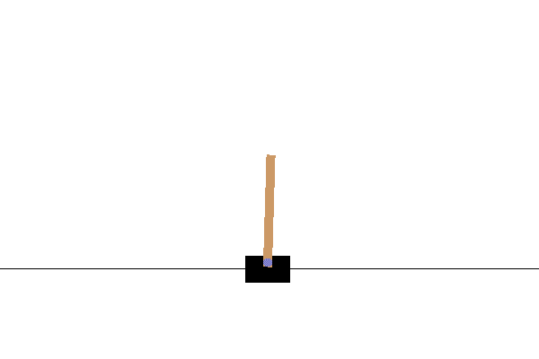

## ECE598SG (Special Topics in Robot Learning)
### Programming Assignment 2
In this programming assignment you will implement model-free reinforcement
learning methods on the discrete control problem of balancing a cartpole. The
two discrete actions are pushing the cart to the left or the right. The state space is
4 dimensional: location and velocity of the cart, and orientation and angular
velocity of the pole. Reward is measured as weather the cart is within the
limits of the screen, and the pole is in upright position.

You will be solving this system using Q-learning and advantage actor-critic. We
have provided starter code, and you will need to fill in the missing parts of
the code. We will measure performance by looking at the sample complexity of
learning a good policy (in this environment determined if the reward over a 200
step episode is over 195).  As training in RL is high-variance, so you should
test each variant 3 to 5 times and report the mean and standard deviation in
episode reward over the different runs. We have provided code to produce such
learning plots. 

1. **Deep Q-Learning**. We will implement Q-learning, but represent the
   Q-function with a multi-layer perceptron. You can use the `DQNPolicy`
   implemented in [policies.py](./policies.py). You will need to implement a
   replay buffer, and the Q-learning updates in
   [trainer_dqn.py](./trainer_dqn.py). You can run your training with the
   following command: `python run_model_free_rl.py --logdir LOGDIR
   --num_train_envs 8 --algo dqn --seed 0`.  It will save the performance on a
   fixed set of 100 validation environments as a function of number of
   environmental interactions used, in the directory `LOGDIR/seed0/val`.  You
   can also view the behavior of your learned policy by adding in a `--vis`
   flag. You can do multiple runs, by changing the seed.  You can aggregate
   these runs using: `python aggregate_and_plot.py --logdirs "LOGDIR1 LOGDIR2"
   --output_file_name a.pdf --seeds 5`. Feel free to modify this plotting
   script as necessary.
   
   **Implementation [20pts]**. Implement your Q-learning solution to this
   problem.  You may need to search over hyper-parameters: e.g. appropriate
   schedule for epsilon (for epsilon-greedy exploration), how often to update
   the target network, how often to get experience vs how often to train,
   learning rates, etc. In addition to these, experiment with any *two* of the
   common DQN extensions. See the [Rainbow
   DQN](https://arxiv.org/abs/1710.02298) paper for ideas. You should include
   *control* experiments that test the effectiveness of these extensions on this
   problem.
      
   In your report, carefully document and report the major things you try, by
   noting the key design details, design rationale, and the impact on training
   plots and validation metrics. You should also include the relevant training
   plots and validation metrics.  As a reference, our basic implementation is
   able to start doing well in 50000 samples, in under 5 minutes of training on
   a single CPU. You may be able to do better much faster.

2. **Actor Critic**. Next we will implement variants of the Actor Critic
   algorithm. We have provided an policy `ActorCriticPolicy` in
   [policies.py](./policies.py), and some starter code in
   [trainer_ac.py](./trainer_ac.py). You will have to fill in code for
   collecting roll-outs and setting up the actor critic training. You can run
   your training using the following command: `python run_model_free_rl.py
   --logdir LOGDIR --num_train_envs 8 --algo ac --seed 0`.
   As above, you can aggregate results from multiple runs using the
   `aggregate_and_plot` script. 
   
   **Implementation [20pts]**. Complete your implementation. As above, you will
   need to search over hyper-parameters, e.g.: learning rates, number of
   parallel training environments, length of rollouts, etc. In addition to
   these, experiment with using a state-dependent baseline (i.e. advantage actor
   critic) vs not using it (i.e. q-value actor critic) when updating the
   policy.
      
   As above, in your report, carefully document and report the major things you
   try, by noting the key design details, design rationale, and the impact on
   training plots and validation metrics. You should also include the relevant
   training plots and validation metrics.  As a reference, our very basic
   implementation is able to start getting good rewards in 500K samples, in
   under 5 minutes of training on a single CPU. You may be able to do better
   much faster.
 
#### Instructions
1. Assignment is due at 11:59PM on Thursday October 7, 2021.
2. Please see
[policies](http://saurabhg.web.illinois.edu/teaching/ece598sg/fa2021/policies.html)
on [course
website](http://saurabhg.web.illinois.edu/teaching/ece598sg/fa2021/index.html).
3. Submission instructions:
   1. A single report for all questions in PDF format, to be submitted to
   gradescope (under assignment `MP2`). This report
   should contain all that you want us to look at. Please also tag your PDF
   with locations for each question in the gradescope interface.
   2. You also need to submit code for all questions in the form of a single
   `.zip` file that contains `.py` files (and not `.ipynb` notebook files).
   Please submit this under `MP2-code` on gradescope.  
   3. We reserve the right to take off points for not following submission
   instructions.
4. We believe you should be able to work on these problems even without a GPU.
If you do happen to need a GPU, you can use GPUs on the [campus
cluster](http://saurabhg.web.illinois.edu/teaching/ece598sg/fa2021/compute.html),
and also through Google Colab. Please see course website for instructions on
how to use campus cluster. Instructions to use Google Colab can be found in
[MP1](../MP1).
5. Lastly, be careful not to work of a public fork of this repo. Make a *private*
clone to work on your assignment. 
